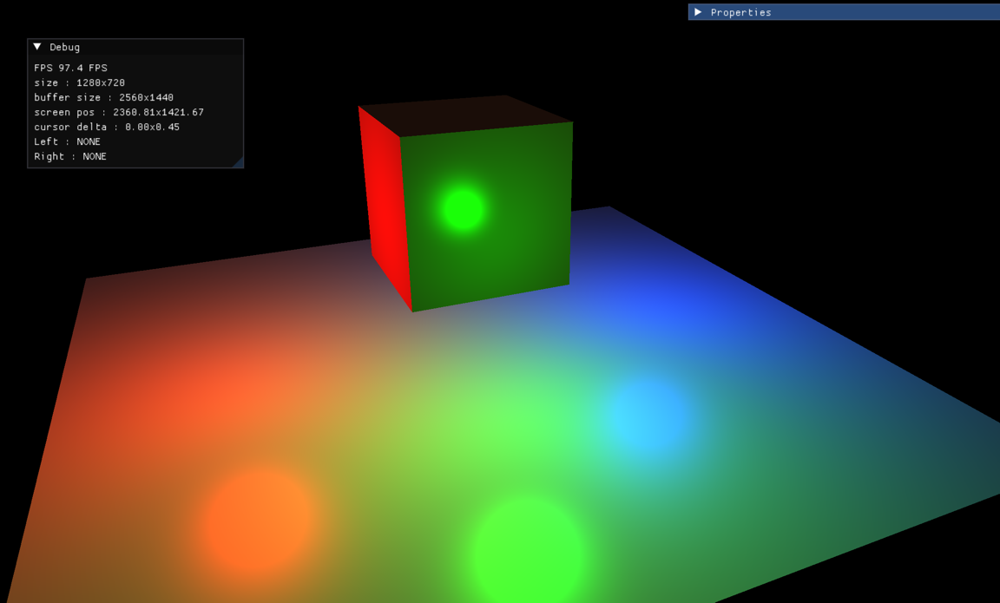

# TEngine

OpenGL 2D, 3D Game engine.   

## Goal

This engine is not designed to be a general-purpose game engine.   
Instead, it focuses on combining essential engine functionality with a curated set of built-in systems and opinionated features.   
The goal is to accelerate the journey from idea to playable experience while giving every project a distinctive identity shaped by the engine itself.

## WIP

### Core system ... 

